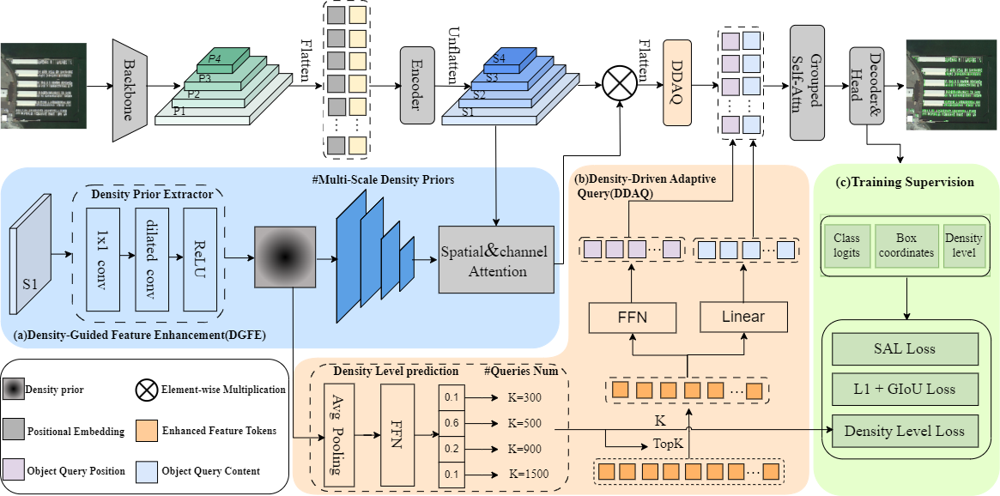

# DQSA-DETR: A Density-Guided Adaptive DETR Framework for Tiny Object Detection in Remote Sensing Image


This repository is an official implementation of the paper DQ-DETR: DETR with Dynamic Query for Tiny Object Detection.

## Installation -- Compiling CUDA operators

`conda` virtual environment is recommended.

```bash
conda create -n dqsadetr python=3.9 --y
conda activate dqsadetr
# Install other requirements
bash install.sh
```
## Trained Model
Changed the pretrained model path in DQSA.sh
```bash
CUDA_VISIBLE_DEVICES=0 bash scripts/DQSA.sh /path/to/your/dataset
```
## Dataset

1. [AI-TOD-V2](https://drive.google.com/drive/folders/1CowS5BrujefWQxxlmOFfUuLOfUUm8w6U?usp=sharing)

2. [Visdrone-2019](https://github.com/VisDrone/VisDrone-Dataset)

3. [Dota-v1.0](https://captain-whu.github.io/DOTA/dataset.html)

   

## Acknowledgement

The code are built upon the official [DINO DETR](https://github.com/IDEA-Research/DINO) repository. Thanks for their excellent work!

## Citation

If our code or models help your work, please cite our paper:
```bash

```